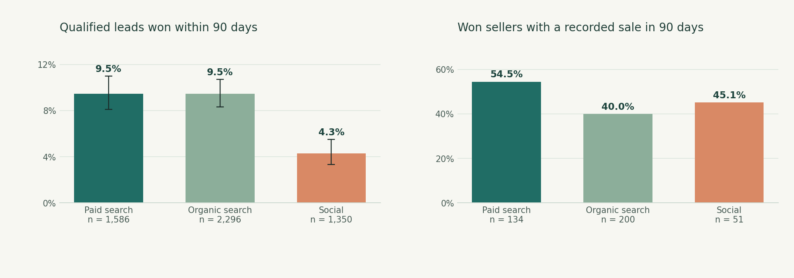

# Seller Growth & Revenue Intelligence

An end-to-end, reproducible marketplace analytics case study. The business
question is whether seller acquisition sources bring in merchants who go on
to record sales, not simply merchants who sign up. The project links Olist's
public seller-lead and won-deal data to order-item and order data, with matched
lead-to-win and win-to-sale observation windows.



The chart compares historical cohorts; it does not measure the causal effect
of spending in any channel. Interactive details and uncertainty are in the
dashboard.

## What you can open now

- [Live interactive dashboard](https://jskjames.github.io/olist-seller-growth-intelligence/):
  choose a channel, review intervals and recorded seller sales, and adjust an
  illustrative planning scenario directly in your browser.
- [Financial scenario workbook](outputs/de15249559e3/olist_seller_growth_scenario.xlsx):
  change the highlighted input cells; observed data and assumptions are kept
  on separate worksheets.
- [Findings](docs/findings.md), [measure definitions](docs/method.md), and
  [audited CSV outputs](outputs/): see the dataset and eligibility behind each
  statement. [SQL queries](sql/analytical_queries.sql) show the warehouse
  logic. Tests check order-item grain and interval boundaries.

## Verified headline results

The four source CSVs contain **8,000 qualified leads, 842 won deals, 112,650
order items and 99,441 orders**. Within a comparable 90-day window, **690
leads won (8.625%)**. Of **635 sellers won within 90 days with a full sales window**, **276** have at least
one recorded delivered order in 90 days; their total recorded item sales are
**R$328,334.48**. These are observed Olist historical-extract counts, not
incremental results or company profit. See [findings](docs/findings.md) for
the source-specific comparisons and limitations.

## Run it yourself

```bash
python -m venv .venv
source .venv/bin/activate       # Windows: .venv\Scripts\activate
pip install -r requirements.txt
python scripts/download_data.py
PYTHONPATH=src python -m growth.pipeline  # Windows PowerShell: $env:PYTHONPATH='src'; python -m growth.pipeline
PYTHONPATH=src python -m unittest discover -s tests -v
python scripts/build_figures.py
node tests/test_dashboard.mjs
```

You can instead download the original [Olist marketing funnel](https://www.kaggle.com/datasets/olistbr/marketing-funnel-olist)
and [Brazilian e-commerce](https://www.kaggle.com/datasets/olistbr/brazilian-ecommerce)
CSVs from Kaggle and put the four filenames listed in
`scripts/download_data.py` under `data/raw/`. The download script uses a
[public GitHub mirror](https://github.com/dujiaying/olist/tree/master/data)
and checks source hashes against this case study's audit. Raw third-party CSVs
are intentionally excluded from the deliverable; derived aggregate results
are included, so the dashboard can be opened immediately.

The pipeline uses pandas for input checks, SQLite for indexed source tables
and joins, NumPy for seeded bootstrap uncertainty and plain HTML/CSS/JS for
the interactive dashboard. Workbook figures come from the same exported
audited channel metrics. No synthetic rows, paid data services or secret API
keys are needed.

## Why this is a decision project

The analysis distinguishes lead conversion from downstream merchant outcomes,
audits unknown acquisition origins and incomplete order coverage, and shows
what would need to be measured before recommending a change in spend. The
scenario models hypothetical fees and program cost only; the public source
does not establish causation, Olist fees, acquisition costs or net profit.
This is an independent portfolio case study, not an Olist company report.
